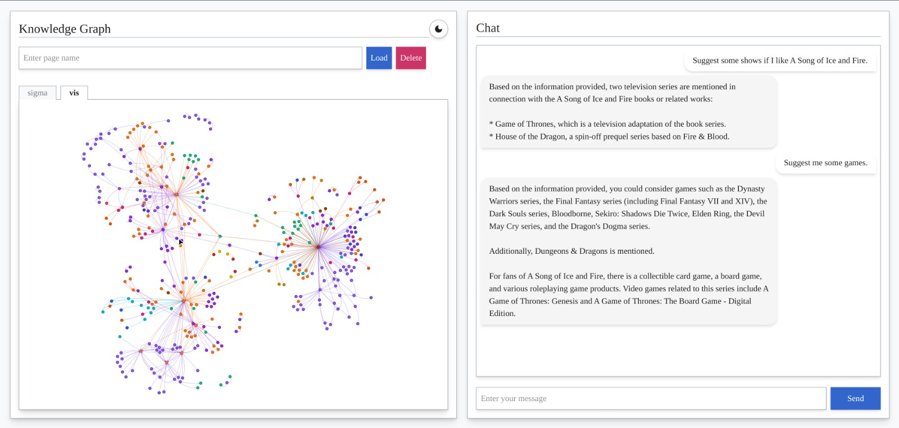

## WikiRecommender


Knowledge graph loaded for The Lord of the Rings, A Song of Ice and Fire and Berserk.

#### Instructions

1. Navigate to the project folder.
1. Modify `backend/.env_template` and rename/copy to `backend/.env`.
1. Terminal 1 - In the root folder run
   ```
   neo4j console
   ```
1. Terminal 2 - In the `backend` folder run
   ```
   uv run serve.py
   ```
1. Terminal 3 - In the `frontend` folder run
   ```
   bun run index.ts
   ```
1. Navigate to `localhost://3000` on your browser

TODO:

- Custom KG-RAG pipeline
- Non-blocking/async backend
- Convert JS to TS
- Several other modifications
